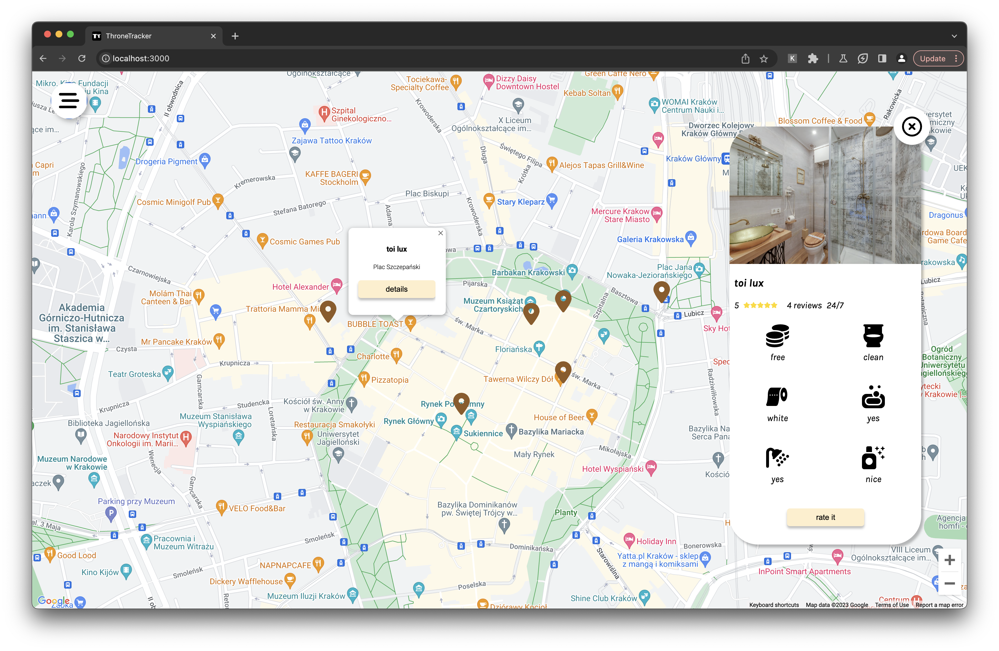
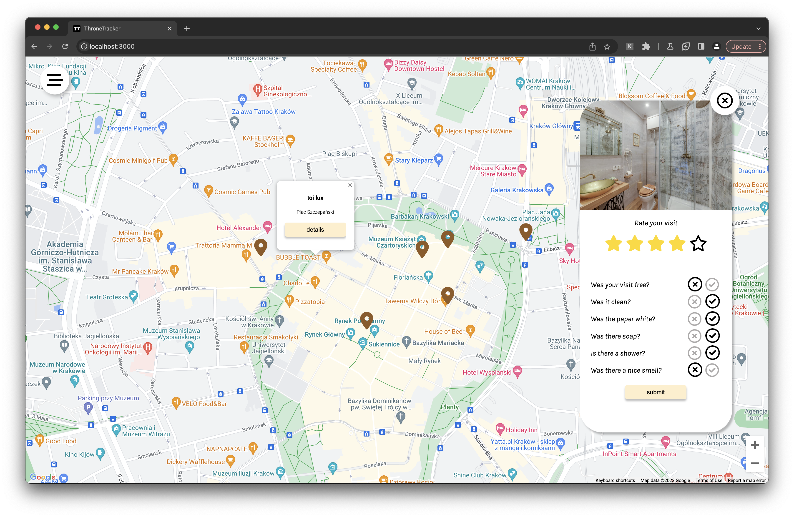
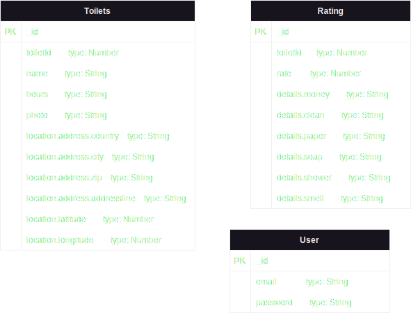

<p align="center">
   <a href="https://github.com/Zoltw/throne-tracker">
     
   </a>
</p>

 <h1 align="center">Throne Tracker</h1>
 <br/>

  ## Setting up development environment of project

 ### Requirements:
 - [Docker](https://www.docker.com/)
 - [Node.js](https://nodejs.org/en/)

1. Make sure that you have `Node.js` and `Docker` installed.
2. Clone the repository
 ```bash
 git clone https://github.com/Zoltw/throne-tracker.git
 ```
3. Go to `frontend` directory
 ```bash
 cd frontend
 ```
 4. Copy .env.template to .env
 ```bash
  cp .env.template .env
  ```
 5. Provide your google maps Api key and backend URL in .env file
 ```bash
 VITE_GOOGLE_MAPS_API_KEY= 
 VITE_APP_BACKEND_URL=  #eg http://localhost:8080
 ```
 6. Back to root directory
 ```bash
cd ..
 ```
 7. On working directory
  ```bash
  docker-compose up
  ```
 8. Server is running on port 3000 - `http://localhost:3000`
## Early view of project
<p align="center">
  
  
</p>

## Diagram

<p align="center">
  
</p>